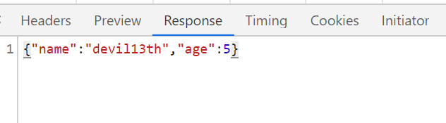

# RestTemplate

> ​    调用远程服务时就必须使用HTTP客户端,主要有四种：JDK原生的URLConnection、Apache的Http Client、Netty的异步HTTP Client, Spring的RestTemplate。
> ​    restTemplate是spring提供的可以提供访问rest服务的客户端工具类，提供多种快捷的访问远程的方法，大大提高了客户端的编程效率。解放了原先HttpClient的复杂提交，java中调用RESTful服务很典型的是使用HttpClient，对于常用的REST操作，这些方法属于低等级的操作。使用HttpClient我们需要自己封装Post请求，再`根据响应的状态码判断从响应中获取header和body`，有时候还需要自己做json转换。

# Http请求格式

介绍RestTemplate之前，先看一下http请求格式

## 请求行
  请求行中，有请求的地址和方式，使用chrome查看请求行如下

  

## 请求头

请求头中是一些键值对，用chrome查看请求头如下图


与请求体有关的常用属性是content-type，标志着请求体内容的数据格式

## 请求体

一般情况下，请求体中是发送的数据，用chrome查看请求体内容如下


上面是三种请求体服务端是通过请求头中content-type属性值来获取请求体的数据格式的

 协议规定post提交的数据，必须包含在消息主体中entity-body中，但是协议并没有规定数据使用什么编码方式。开发者可以自己决定消息主体的格式。

        数据发送出去后，需要接收的服务端解析成功，一般服务端会根据content-type字段来获取参数是怎么编码的，然后对应去解码
# Http响应格式

## 响应头

响应头中常用的属性有content-type，标明数据返回(请求体中的数据)的格式，用chrome查看截图如下


## 响应体




# RestTemplate的一些概念

- url 请求地址
- method 请求方法，例如Get Post Put Delete Fetch
- HttpEntity对象，封装了请求头和请求体
- ResponseEntity，封装了响应头和响应体
- HttpMessageConverter接口，对**请求体**和**响应体**的转换器，有众多的转换器，后期我们会使用fastjson转换器将请求体的内容直接反序列化成我们需要的对象

## !!!RestTemplate发送请求的抽象过程和注意事项

1. 使用HttpMessageConverter将HttpEntity对象中的请求体处理后以method方式发送至url
2. 服务端处理
3. 服务端返回ResponseEntity响应对象，RestTemplate通过HttpMessageConverter将响应体的内容转换成我们需要的内容。

### !!!注意事项

RestTemplate中有众多个HttpMessageConverter(转换器)，在处理数据的时候依次调用每个转换器对请求体或响应体进行处理，如果有一个转换器可以处理则其他转换器就不会工作了。需要注意的是非JSON 字符串要是遇到了FastJsonHttpMessageConverter会报错！所以处理非JSON字符串的时候不要在RestTemplate中设置FastJsonHttpMessageConverter，可以自行构建RestTemplate，参见`例子`章节中的`Get请求获取字符串`

## 通常做法

## Get

通常情况下

1. 服务端返回的是普通字符串
2. 服务端返回的是JSON

## Post

RestTemplate使用的两种方式

1. 客户端将对象以JSON形式发送服务端，一般情况下是Post，然后返回是JSON格式数据，直接转换成对象
2. 客户端将数据发送至服务端（非JSON），一般情况下是POST，然后返回是JSON格式或字符串数据。

HttpEntity<T>对象的泛型就是客户端发送数据时请求体中对应对象的类型

ResponseEntity<T>对象的泛型就是客户端接收服务端数据后将响应体的内容转换成的对象类型

对于JSON和对象的转换，可以使用FastJsonHttpMessageConverter，对于普通的字符串，可以使用StringHttpMessageConverter

#  RestTemplate构造函数 

- 默认构造函数

  默认使用SimpleClientHttpRequestFactory，使用JDK自带的java.net包进行网络传输。

- public RestTemplate(ClientHttpRequestFactory requestFactory)。

  传入一个ClientHttpRequestFactory，ClientHttpRequestFactory在Spring中的实现有很多个，如HttpComponentsClientHttpRequestFactory，Netty4ClientHttpRequestFactory等，具体的可以看代码，这里只介绍HttpComponentsClientHttpRequestFactory，需要用到 HttpClient4.

- public RestTemplate(List<httpmessageconverter<?>> messageConverters)

  使用SpringMvc的应该对HttpMessageConverter很熟悉了，RestTemplate默认会给我们设置好常用的HttpMessageConverter，我一般很少使用到这个构造方法。

# Post方式的数据格式

## form-data

就是http请求中的multipart/form-data,它会将表单的数据处理为一条消息，以标签为单元，用分隔符分开。它既可以上传键值对，也可以上传文件。当上传的字段是文件时，会有Content-Type来表名文件类型；content-disposition，用来说明字段的一些信息；

## x-www-form-urlencoded

就是application/x-www-from-urlencoded,会将表单内的数据转换为键值对，比如,name='wang', age = "23"这样的方式上传。

在post请求方式下，是一个个键值对的方式上传，类似

key1:name1,

key2:name2,

key3:name3

这样的方式上传。


而get请求方式，是将数据转化为一个串，以&间隔，上传，类似  http://localhost:8080/test?name=jun&age=26

## raw

可以上传json、文本等

## binary

从字面意思得知，只可以上传二进制数据，从而只可以上传文件。


5、multipart/form-data与x-www-form-urlencoded区别

​        multipart/form-data：既可以上传文件等二进制数据，也可以上传表单键值对，只是最后会转化为一条信息；

​        x-www-form-urlencoded：只能上传键值对，并且键值对都是间隔分开的。

# RestTemplate主要方法

## 公共方法参数介绍


- url
请求路径
- method
请求的方法（GET、POST、PUT等），可以使用HttpMethod.xxx 枚举类型
- requestEntity
HttpEntity对象，封装了请求头和请求体，一般情况下只有POST方式会有请求体，对于请求体中是json数据格式一般采用@RequestBody来接收
- responseType
返回数据类型（如果获取原始类型则使用String.class，如果是json数据一般会设置成所需对象的class）
- uriVariables
支持PathVariable类型的数据。对于urlVariables的使用如下图


## exchange方法

在url上执行特定的HTTP方法，返回包含对象的ResponseEntity,这个对象时从响应体中映射得到的

```
url：请求路径
method：请求的方法（GET、POST、PUT等）
requestEntity：HttpEntity对象，封装了请求头和请求体
responseType：返回数据类型（如果获取原始类型则使用String.class，如果是json数据一般会设置成所需对象的class）
uriVariables：支持PathVariable类型的数据。 
```


## getForEntity()

发送一个HTTP GET请求，返回的ResponseEntity包含了响应体所映射成的对象

## getForObject()

发送一个HTTP GET请求，返回的请求体将映射为一个对象

## postForEntity

POST数据到一个URL，返回包含一个对象的ResponseEntity，这个对象是从响应体中映射得到的

## postForObject()

Post数据到一个URL，返回根据响应体匹配形成的对象

# 例子

## RestTemplate构建

后续的例子中如果使用的是restTemplate则是使用Spring容器中的RestTemplate，构建代码如下

```
@Configuration
public class RestTemplateConfiguration {
    @Bean
    @ConditionalOnMissingBean({RestTemplate.class})
    public RestTemplate restTemplate(ClientHttpRequestFactory factory) {
        RestTemplate restTemplate = new RestTemplate(factory);

        //换上fastjson
        List<HttpMessageConverter<?>> httpMessageConverterList= restTemplate.getMessageConverters();
        Iterator<HttpMessageConverter<?>> iterator=httpMessageConverterList.iterator();
        if(iterator.hasNext()){
            HttpMessageConverter<?> converter=iterator.next();
            //原有的String是ISO-8859-1编码 去掉
            if(converter instanceof StringHttpMessageConverter){
                iterator.remove();
            }

            //由于系统中默认有jackson 在转换json时自动会启用  但是我们不想使用它 可以直接移除或者将fastjson放在首位
            /*if(converter instanceof GsonHttpMessageConverter || converter instanceof MappingJackson2HttpMessageConverter){
                iterator.remove();
            }*/

        }
        httpMessageConverterList.add(new StringHttpMessageConverter(Charset.forName("utf-8")));
        FastJsonHttpMessageConverter fastJsonHttpMessageConverter = new FastJsonHttpMessageConverter();
        FastJsonConfig fastJsonConfig = new FastJsonConfig();
        fastJsonConfig.setSerializerFeatures(
                SerializerFeature.WriteMapNullValue,
                SerializerFeature.WriteNullStringAsEmpty,
                SerializerFeature.WriteNullListAsEmpty,
                SerializerFeature.DisableCircularReferenceDetect);

        fastJsonHttpMessageConverter.setFastJsonConfig(fastJsonConfig);
        httpMessageConverterList.add(0,fastJsonHttpMessageConverter);

        return restTemplate;

    }

    @Bean
    @ConditionalOnMissingBean({ClientHttpRequestFactory.class})
    public ClientHttpRequestFactory requestFactory() {
        SimpleClientHttpRequestFactory factory = new SimpleClientHttpRequestFactory();
        //ms
        factory.setConnectTimeout(15000);
        factory.setReadTimeout(15000);
        return factory;
    }
}
```

```
@Configuration
public class MvcConfig implements WebMvcConfigurer {


    // WebMvcConfigurerAdapter 这个类在SpringBoot2.0已过时，官方推荐直接实现WebMvcConfigurer 这个接口
    /**
     * 使用fastjson代替jackson
     * @param converters
     */
    @Override
    public void configureMessageConverters(List<HttpMessageConverter<?>> converters) {
        /*
         先把JackSon的消息转换器删除.
         备注: (1)源码分析可知，返回json的过程为:
                    Controller调用结束后返回一个数据对象，for循环遍历conventers，找到支持application/json的HttpMessageConverter，然后将返回的数据序列化成json。
                    具体参考org.springframework.web.servlet.mvc.method.annotation.AbstractMessageConverterMethodProcessor的writeWithMessageConverters方法
               (2)由于是list结构，我们添加的fastjson在最后。因此必须要将jackson的转换器删除，不然会先匹配上jackson，导致没使用fastjson
        */
        for (int i = converters.size() - 1; i >= 0; i--) {
            if (converters.get(i) instanceof MappingJackson2HttpMessageConverter) {
                converters.remove(i);
            }
        }
        FastJsonHttpMessageConverter fastJsonHttpMessageConverter = new FastJsonHttpMessageConverter();
        //自定义fastjson配置
        FastJsonConfig config = new FastJsonConfig();
        config.setSerializerFeatures(
                SerializerFeature.WriteMapNullValue,        // 是否输出值为null的字段,默认为false,我们将它打开
                SerializerFeature.WriteNullListAsEmpty,     // 将Collection类型字段的字段空值输出为[]
                SerializerFeature.WriteNullStringAsEmpty,   // 将字符串类型字段的空值输出为空字符串
                SerializerFeature.WriteNullNumberAsZero,    // 将数值类型字段的空值输出为0
                SerializerFeature.WriteDateUseDateFormat,
                SerializerFeature.DisableCircularReferenceDetect ,   // 禁用循环引用
                SerializerFeature.WriteClassName// 写入全类名
        );
        // 日期类型格式化格式
        config.setDateFormat("yyyyMMdd");
        fastJsonHttpMessageConverter.setFastJsonConfig(config);
        // 添加支持的MediaTypes;不添加时默认为*/*,也就是默认支持全部
        // 但是MappingJackson2HttpMessageConverter里面支持的MediaTypes为application/json
        // 参考它的做法, fastjson也只添加application/json的MediaType
        List<MediaType> fastMediaTypes = new ArrayList<>();
        fastMediaTypes.add(MediaType.APPLICATION_JSON_UTF8);
        fastJsonHttpMessageConverter.setSupportedMediaTypes(fastMediaTypes);
        converters.add(fastJsonHttpMessageConverter);
    }
}

```


## Get请求获取字符串

服务端返回的是字符串（可以是Html也可以是Json或其他任意字符串）

服务端代码：

```
@ResponseBody
@RequestMapping(value="/testGet01",method=RequestMethod.GET)
    // url : http://127.0.0.1:8899/thd/receive/testGet01
    // 返回字符串
    public ResponseEntity<String> testGet01(){
        this.log.info("testGet01");
        return ResponseEntity.ok(" Hello RestTemplate ");
}
```

客户端代码：

**注意：这里没有用系统的restTemplate，因为系统中的RestTemplate加入了fastjsonHttpMessageConverter如果是字符串会用这个转换器转换而报错。后续列子不做赘述**

```
@RequestMapping("/testGet01")
@ResponseBody
/**
* @see ReceiveController#testGet01()
* Get 方式访问任意地址 , 服务端返回的是字符串 (也可以是json)
*/
// url : http://127.0.0.1:8899/thd/restTemplate/testGet01
public ResponseEntity testGet01(){
    RestTemplate rt = new RestTemplate();
    rt.getMessageConverters().add(0, new StringHttpMessageConverter(Charset.forName("UTF-8")));

    String url = "https://www.baidu.com";
    // url = "http://127.0.0.1:8899/thd/receive/testGet01";

    ResponseEntity<String> entity =  rt.getForEntity(url,String.class);
    System.out.println(entity.getHeaders());
    System.out.println(entity.getBody());
    System.out.println(entity.getStatusCode());

    System.out.println(" =======================  ");

    ResponseEntity<String> res =  rt.getForEntity("http://127.0.0.1:8899/thd/receive/testGet01",String.class);
    System.out.println("响应头:" + res.getHeaders());
    System.out.println("响应体:" + res.getBody());
    System.out.println("响应状态码:" + res.getStatusCode());

    return ResponseEntity.ok(entity.getBody());
}
```

## Get请求获取JSON

服务端返回的响应体是一段JSON，并且要在本地直接转换为我们要的对象

服务端代码：

```
@ResponseBody
@RequestMapping(value="/testGet02",method=RequestMethod.GET)
// url : http://127.0.0.1:8899/thd/receive/testGet02
// 返回对象
public ResponseEntity<Person> testGet02(){
    this.log.info("testGet01");
    Person p = new Person();
    p.setName("devil13th");
    p.setAge(5);
    p.setBirthday(new Date());
    return ResponseEntity.ok(p);
}
```

客户端代码：

```
/**
* @see ReceiveController#testGet02()
* 服务端返回JSON
*/
@RequestMapping("/testGet02")
@ResponseBody
// url : http://127.0.0.1:8899/thd/restTemplate/testGet02
public ResponseEntity testGet02(){
    Person p = new Person();
    p.setAge(1);
    p.setName("testGet02");

    // 使用restTemplate.getForEntity发送get请求
    ResponseEntity<Person> entity = restTemplate.getForEntity("http://127.0.0.1:8899/thd/receive/testGet02",Person.class);
    System.out.println("响应头:" + entity.getHeaders());
    System.out.println("响应体:" + entity.getBody());
    System.out.println("响应状态码:" + entity.getStatusCode());
    System.out.println(entity.getStatusCodeValue());

    System.out.println(" ============================= ");

    // 使用restTemplate.getForObject发送get请求
    Person result = restTemplate.getForObject("http://127.0.0.1:8899/thd/receive/testGet02",Person.class);
    System.out.println("响应体：" + result);

    return ResponseEntity.ok(result);
}
```

## Get请求带参数

形如 xxx.do?a=1&b=2的Url

服务端代码：

```
@ResponseBody
@RequestMapping(value="/testGet03",method=RequestMethod.GET)
//直接获取url?后面对应的参数
//url : http://127.0.0.1:8899/thd/receive/testGet03?usr=devil13th&pwd=123456
public Person testGet03(@RequestParam String usr, @RequestParam String pwd){
    this.log.info("testGet03");
    System.out.println(usr + "," + pwd);
    Person p = new Person();
    p.setName(usr);
    return p;
}
```

客户端代码：

```
/**
* @see ReceiveController#testGet03(String, String)
* Get 方式 url中带有参数
*/
@RequestMapping("/testGet03")
@ResponseBody
// url : http://127.0.0.1:8899/thd/restTemplate/testGet03
public ResponseEntity testGet03(){
    Person p = new Person();
    p.setAge(1);
    p.setName("test01");
    Person result =  restTemplate.getForObject("http://127.0.0.1:8899/thd/receive/testGet03?usr=devil13th&pwd=123456",Person.class);
    return ResponseEntity.ok(result);
}
```

其实和第二种方式是一样的，也可以使用第一种方式获取响应体的JSON字符串

## Get请求参数包含在路径中

形如 query/zhangsan (zhangsan是参数)

服务端代码：

```
 @ResponseBody
 @RequestMapping(value="/testGet04/{str}",method=RequestMethod.GET)
 // 通过在url中使用{}占位符来获取参数
 //url : http://127.0.0.1:8899/thd/receive/testGet04/hello
 public ResponseEntity<Person> testGet04(@PathVariable String str ){
     this.log.info("testGet04");
     System.out.println(str);
     Person p = new Person();
     p.setBirthday(new Date());
     p.setAge(1);
     p.setName(str);
     return ResponseEntity.ok(p);
 }
```

客户端代码：

```
/**
* @see ReceiveController#testGet04(String)
*/
@RequestMapping("/testGet04")
@ResponseBody
// url : http://127.0.0.1:8899/thd/restTemplate/testGet04
// Get方式请求参数包含在路径中
public ResponseEntity testGet04(){
    RestTemplate rt = new RestTemplate();
    rt.getMessageConverters().add(0, new StringHttpMessageConverter(Charset.forName("UTF-8")));
    ResponseEntity<String> entity =  rt.getForEntity("http://127.0.0.1:8899/thd/receive/testGet04/hello",String.class);
    System.out.println(entity.getHeaders());
    System.out.println(entity.getBody());
    System.out.println(entity.getStatusCode());

    return ResponseEntity.ok(entity.getBody());
}
```


## Post数据是JSON格式


这种方式服务端是以@RequestBody注释的参数来接收一段JSON字符串，通常客户端会设置Content-Type=application/json来告诉服务端发送的是一段JSON数据

服务端代码：

```
@ResponseBody
@RequestMapping(value="/testPost01",method=RequestMethod.POST)
//通过Post方式提交来body内容(一般是json),可以通过@RequestBody直接将body中的json转成对象
//注意这种方式要设置头部信息的contentType属性 headers.set('Content-Type', 'application/json');
//url : http://127.0.0.1:8899/thd/receive/testPost01
public ResponseEntity<Person> testPost01(@RequestBody Person person){
    this.log.info("testPost01");
    Person p = person;
    person.setName(person.getName() + " ... ");
    System.out.println(person);
    return ResponseEntity.ok(p);
}
```

客户端代码：

```
/**
* @see ReceiveController#testPost01(Person)
* 请求发送JSON数据，返回的也是JSON数据
* 服务端是 @RequestBody 注释参数
*/
@RequestMapping("/testPost01")
@ResponseBody
// url : http://127.0.0.1:8899/thd/restTemplate/testPost01
public ResponseEntity testPost01(){

    String url = "http://127.0.0.1:8899/thd/receive/testPost01";
    // 请求头
    HttpHeaders headers = new HttpHeaders();
    headers.setContentType(MediaType.APPLICATION_JSON);
    headers.add("Accept", MediaType.APPLICATION_JSON_VALUE);

    // 请求体
    Person p = new Person();
    p.setName("devil13th");
    p.setAge(2);
    p.setBirthday(new Date());
    HttpEntity<Person> httpEntity = new HttpEntity<Person>(p,headers);

    System.out.println(" ========== 发送信息 ===========");
    System.out.println("headers:" + httpEntity.getHeaders());
    System.out.println("body:" + httpEntity.getBody());
    // 使用postForEntity方法
    ResponseEntity<String> res =  restTemplate.postForEntity(url,httpEntity,String.class);
    System.out.println(" ========== 接收信息 ===========");
    System.out.println("body:" + res.getBody());
    System.out.println("header:" + res.getHeaders());
    System.out.println("================================");
    // 使用postForObject方法
    Person result = restTemplate.postForObject(url,httpEntity,Person.class);
    System.out.println(" ========== 接收信息 ===========");
    System.out.println("接收信息:" + result);

    return ResponseEntity.ok("SUCCESS");
}
```

## Post请求发送表单数据

和Html的表单一样，服务端通常使用@ModelAttribute注释来修饰接收的参数

服务端代码：

```
@ResponseBody
@RequestMapping(value="/testPost02",method=RequestMethod.POST)
// 客户端以formData的方式发送
// form 表单提交接收参数需要使用@ModelAttribute("person"),
// 表单中的name不要加person前缀，例如name="person.id"应写成name="id"
public Person testPost02(@ModelAttribute("person") Person person){
    this.log.info("testPost02");
    System.out.println(person);
    return person;
}
```

客户端代码：
```
/**
* @see ReceiveController#testPost02(Person)
* 服务端是 @ModelAttribute 注释参数
*/
@RequestMapping("/testPost02")
@ResponseBody
// url : http://127.0.0.1:8899/thd/restTemplate/testPost02
public ResponseEntity testPost02(){

    // 请求头
    HttpHeaders headers = new HttpHeaders();
    headers.setContentType(MediaType.APPLICATION_FORM_URLENCODED);
    List<MediaType> accepts = new ArrayList<MediaType>();
    accepts.add(MediaType.APPLICATION_JSON);
    accepts.add(MediaType.APPLICATION_JSON_UTF8);
    accepts.add(MediaType.TEXT_PLAIN);
    headers.setAccept(accepts);
    // 请求体 - 模拟formData
    MultiValueMap formData = new LinkedMultiValueMap();
    formData.add("name","zhangsan");
    formData.add("age","4");

    HttpEntity<MultiValueMap<String, String>> httpEntity = new HttpEntity<MultiValueMap<String, String>>(formData,headers);

    System.out.println(" ========== 发送信息 ===========");
    System.out.println("headers:" + httpEntity.getHeaders());
    System.out.println("body:" + httpEntity.getBody());


    String url = "http://127.0.0.1:8899/thd/receive/testPost02";


    RestTemplate rt = new RestTemplate();
    // 设置消息转换器为 String类型转换器
    // 当服务端以非@RequestBody注释接收的时候，要使用StringHttpMessageConverter，不能用fastjson, 因为服务端接收数据格式非JSON!
    rt.getMessageConverters().add(0, new StringHttpMessageConverter(Charset.forName("UTF-8")));
    // 使用postForEntity方法
    ResponseEntity<String> res = rt.postForEntity(url, httpEntity, String.class);
    System.out.println(" ========== 接收信息 ===========");
    System.out.println(res);
    System.out.println("====================================");
    // 使用postForObject方法
    Person p =  rt.postForObject(url,httpEntity,Person.class);
    System.out.println("响应结果："+p);

    return ResponseEntity.ok("SUCCESS");
}
```

## Post请求发送字符串数据

在请求体中发送形如name=zhangsan&age=4的字符串数据。服务端接收的参数不加任何注释!!!

服务端代码：

```
@ResponseBody
@RequestMapping(value="/testPost03",method=RequestMethod.POST)
// 表单的body中的数据是以 name=devil13th&age=5 的形式发送,而不是json格式的数据
// 方法参数不要加@ModelAttribute
public Person testPost03(Person person){
    this.log.info("testPost03");
    System.out.println(person);
    return person;
}
```

客户端代码：

```
/**
* @see ReceiveController#testPost03(Person)
*/
@RequestMapping("/testPost03")
@ResponseBody
// url : http://127.0.0.1:8899/thd/restTemplate/testPost03
public ResponseEntity testPost03(){

    String url = "http://127.0.0.1:8899/thd/receive/testPost03";
    HttpMethod method = HttpMethod.POST;

    // 请求头
    HttpHeaders headers = new HttpHeaders();
    headers.setContentType(MediaType.APPLICATION_FORM_URLENCODED);


    HttpEntity<String> httpEntity = new HttpEntity<String>("age=6&name=lisi",headers);

    // 当服务端以非@ResponseBody注释接收的时候，要使用StringHttpMessageConverter，不能用fastjson, 因为服务端接收数据格式非JSON!
    RestTemplate rt = new RestTemplate();
    // 设置消息转换器为 String类型转换器 - 不设置也可以，因为默认的String转换器在JSON转换器前面
    // 但如果使用fastjson,要设置String转换器在FastJson转换器前面
    rt.getMessageConverters().add(0, new StringHttpMessageConverter(Charset.forName("UTF-8")));
    ResponseEntity<String> res = rt.exchange(url,method,httpEntity,String.class);
    System.out.println(" ========== 接收信息 ===========");
    System.out.println(res);
    System.out.println("body:" + res.getBody());
    System.out.println("header:" + res.getHeaders());


    System.out.println("========================");

    return ResponseEntity.ok("SUCCESS");
}
```

